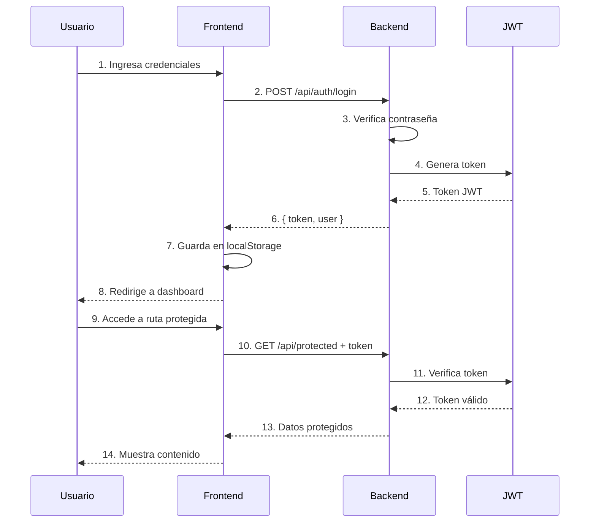

# 🔐 Proyecto Completo de Autenticación

Sistema de autenticación full-stack con React, Express.js y JWT.

## 📁 Estructura del proyecto

```
autenticacion/
├── backend/          # API RESTful con Express.js
│   ├── routes/       # Rutas de la API
│   ├── server.js     # Servidor principal
│   └── package.json
│
├── frontend/         # Aplicación React
│   ├── src/
│   │   ├── components/   # Componentes de UI
│   │   ├── context/      # Context API
│   │   └── services/     # Servicios de API
│   └── package.json
│
└── README.md        # Este archivo
```

## 🎯 Características

### Backend (Express.js)
- ✅ API RESTful con Express
- ✅ Autenticación con JWT (JSON Web Tokens)
- ✅ Hash de contraseñas con bcrypt
- ✅ Middleware de autenticación
- ✅ Validación de datos
- ✅ CORS configurado
- ✅ Variables de entorno

### Frontend (React)
- ✅ React 18 con Hooks
- ✅ Context API para gestión de estado
- ✅ React Router v6 para navegación
- ✅ Rutas protegidas
- ✅ Formularios de login y registro
- ✅ Dashboard protegido
- ✅ UI moderna y responsiva
- ✅ Persistencia de sesión

## 🚀 Instalación rápida

### 1. Instalar dependencias del backend

```bash
cd backend
npm install
```

### 2. Instalar dependencias del frontend

```bash
cd frontend
npm install
```

## ▶️ Ejecutar el proyecto

Necesitas dos terminales para ejecutar backend y frontend simultáneamente.

### Terminal 1: Backend

```bash
cd backend
npm run dev
```

El servidor se ejecutará en `http://localhost:3000`

### Terminal 2: Frontend

```bash
cd frontend
npm run dev
```

La aplicación se ejecutará en `http://localhost:5173`

## 🌐 Uso de la aplicación

### 1. Crear una cuenta

1. Abre `http://localhost:5173`
2. Haz clic en "Registrarse"
3. Completa el formulario:
   - Nombre completo
   - Email
   - Contraseña (mínimo 6 caracteres)
   - Confirmar contraseña
4. Haz clic en "Registrarse"

### 2. Iniciar sesión

1. Navega a "Iniciar Sesión"
2. Ingresa tu email y contraseña
3. Haz clic en "Iniciar Sesión"
4. Serás redirigido al dashboard

### 3. Explorar el dashboard

- Verás tu información de usuario
- Solo accesible para usuarios autenticados
- Área protegida de la aplicación

### 4. Cerrar sesión

- Haz clic en "Cerrar Sesión" en la barra de navegación

## 🧪 Probar la API

### Usando curl

#### Registrar usuario
```bash
curl -X POST http://localhost:3000/api/auth/register \
  -H "Content-Type: application/json" \
  -d '{"email":"test@example.com","password":"test123","name":"Test User"}'
```

#### Login
```bash
curl -X POST http://localhost:3000/api/auth/login \
  -H "Content-Type: application/json" \
  -d '{"email":"test@example.com","password":"test123"}'
```

#### Obtener perfil (reemplaza TOKEN)
```bash
curl http://localhost:3000/api/auth/me \
  -H "Authorization: Bearer TOKEN"
```

### Usando Thunder Client / Postman

1. Importa las peticiones desde la documentación del backend
2. Prueba los endpoints:
   - `POST /api/auth/register`
   - `POST /api/auth/login`
   - `GET /api/auth/me` (con token)
   - `GET /api/protected` (con token)

## 📚 Flujo de autenticación



## 🛡️ Seguridad

### Backend
- ✅ Contraseñas hasheadas con bcrypt (10 salt rounds)
- ✅ Tokens JWT con expiración de 24 horas
- ✅ Validación de datos de entrada
- ✅ No se exponen contraseñas en respuestas
- ✅ Middleware de autenticación para rutas protegidas

### Frontend
- ✅ Tokens almacenados en localStorage
- ✅ Validación de formularios
- ✅ Rutas protegidas con PrivateRoute
- ✅ Redirección automática en sesión expirada
- ✅ Manejo de errores

## 🔧 Configuración

### Variables de entorno (Backend)

Crea un archivo `.env` en `backend/`:

```env
JWT_SECRET=tu-secreto-super-seguro-cambialo-en-produccion
PORT=3000
```

### API URL (Frontend)

Modifica en `frontend/src/services/authService.js`:

```js
const API_URL = 'http://localhost:3000/api/auth';
```

## 📖 Documentación adicional

- [Backend README](backend/README.md) - Documentación detallada del backend
- [Frontend README](frontend/README.md) - Documentación detallada del frontend
- [Guía de Autenticación](../../recursos/autenticacion-react.md) - Guía comprensiva teórica

## 🎓 Conceptos aprendidos

### Backend
- Creación de API RESTful con Express
- Autenticación con JWT
- Hash de contraseñas con bcrypt
- Middleware personalizado
- Manejo de errores
- Variables de entorno

### Frontend
- React Hooks (useState, useEffect, useContext)
- Context API para estado global
- React Router v6
- Componentes de orden superior (HOC)
- Manejo de formularios
- Peticiones HTTP con fetch
- Persistencia de datos con localStorage

### Arquitectura
- Separación frontend/backend
- Comunicación cliente-servidor
- Autenticación basada en tokens
- Rutas protegidas
- Flujo de autenticación completo

## 🚧 Mejoras sugeridas

- [ ] Implementar refresh tokens
- [ ] Agregar recuperación de contraseña
- [ ] Roles y permisos de usuario
- [ ] Autenticación con redes sociales (OAuth)
- [ ] Verificación de email
- [ ] Límite de intentos de login
- [ ] Registro de actividad (logs)
- [ ] Base de datos real (MongoDB, PostgreSQL)
- [ ] Tests unitarios e integración
- [ ] Deploy en producción

## 🐛 Solución de problemas

### Backend no inicia

```
Error: Cannot find module 'express'
```

**Solución**:
```bash
cd backend
npm install
```

### Frontend no puede conectarse al backend

```
Error: Failed to fetch
```

**Solución**:
- Verifica que el backend esté ejecutándose en `http://localhost:3000`
- Verifica CORS en el backend

### Token expirado

```
Error: Token inválido o expirado
```

**Solución**:
- Cierra sesión y vuelve a iniciar sesión
- Los tokens expiran en 24 horas

## 📦 Tecnologías utilizadas

### Backend
- Node.js
- Express.js
- jsonwebtoken
- bcryptjs
- cors
- dotenv

### Frontend
- React 18
- React Router v6
- Vite
- CSS moderno

## 👨‍💻 Desarrollo

### Estructura de archivos clave

**Backend**:
- `server.js`: Servidor principal
- `routes/auth.js`: Rutas de autenticación
- `.env`: Variables de entorno

**Frontend**:
- `src/App.jsx`: Componente principal con rutas
- `src/context/AuthContext.jsx`: Context API para autenticación
- `src/services/authService.js`: Servicios de API
- `src/components/`: Componentes de UI

## 📝 Licencia

Este es un proyecto educativo del curso de Desarrollo Web - PUCE-TEC.

---

**Autor**: Curso Desarrollo Web  
**Fecha**: Enero 2026  
**Versión**: 1.0.0
